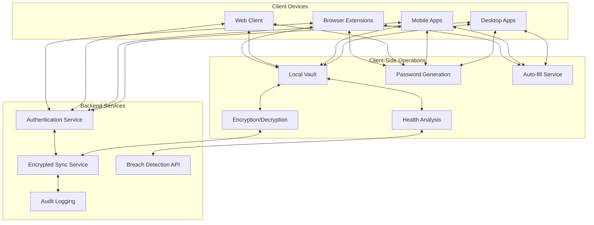
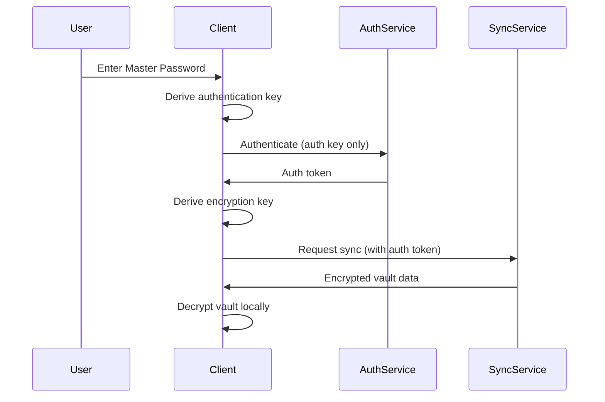
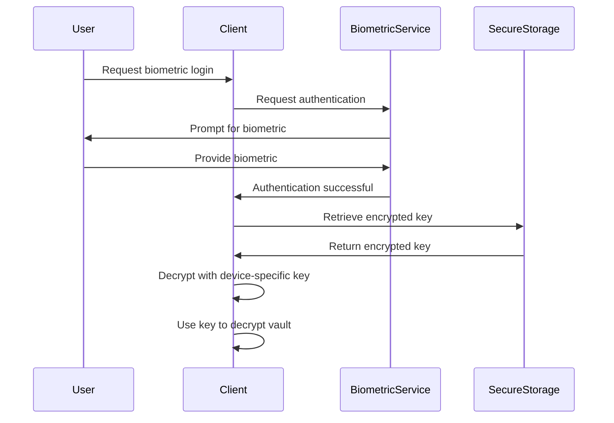
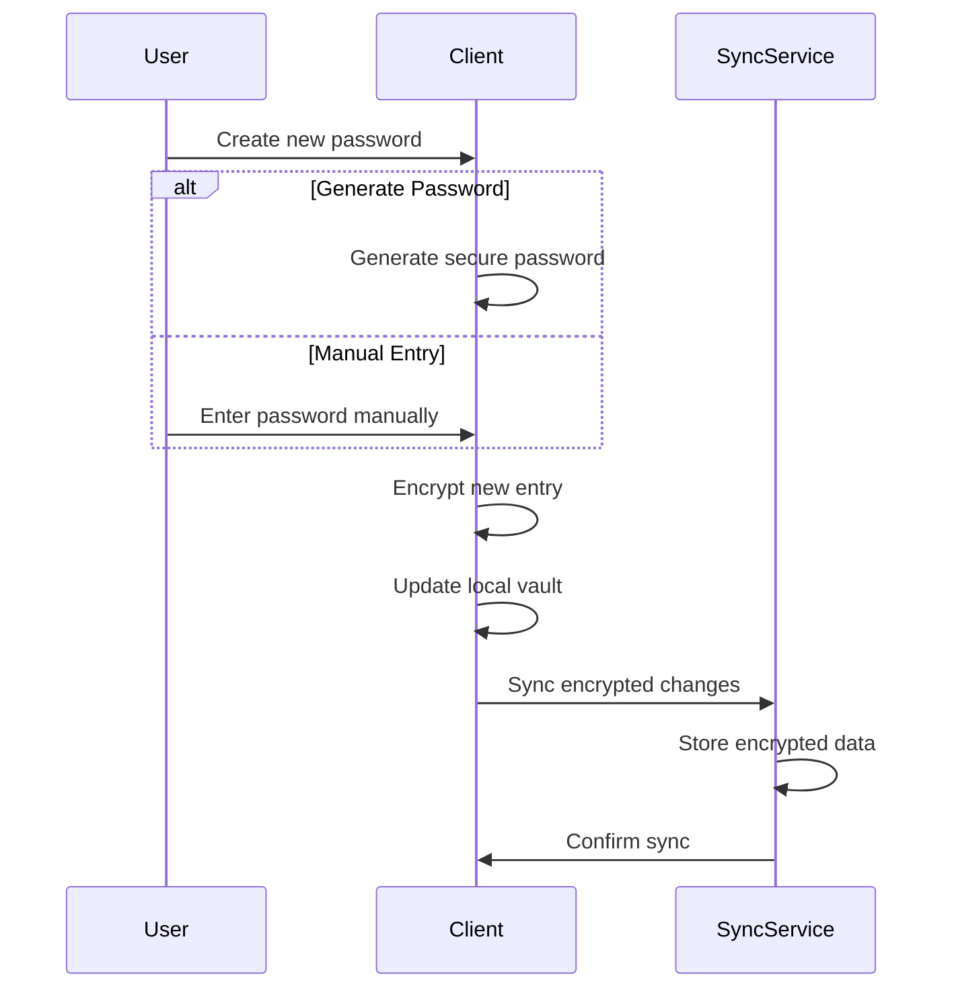
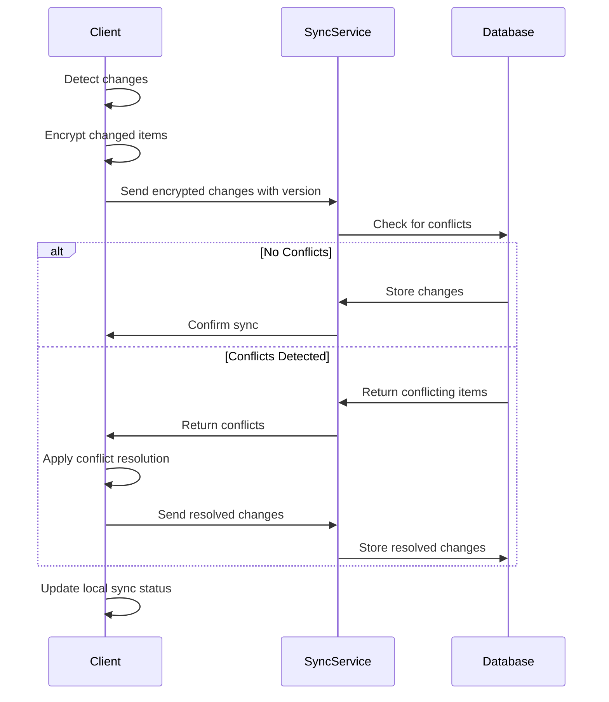
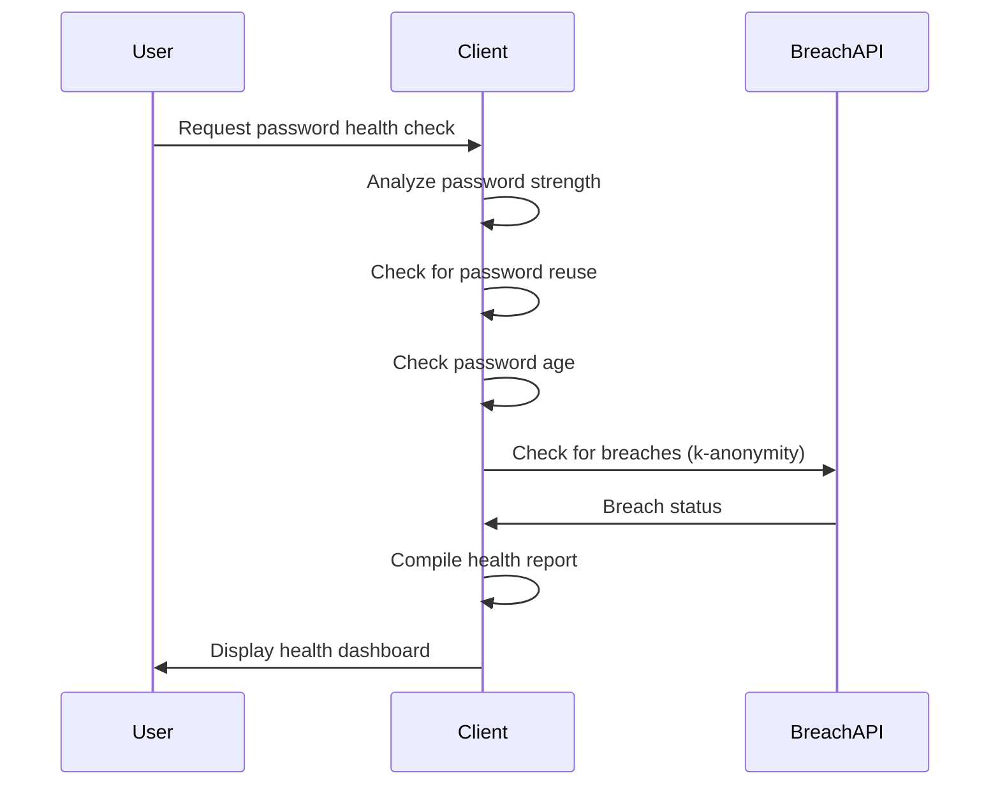

# System Patterns: Secure Password Manager

## System Architecture

Our password manager follows a client-centric architecture with a minimal backend that never has access to unencrypted user data.

### Key Components

1. **Client Applications**
   - Flutter mobile application for iOS and Android
   - Planned Electron applications for desktop platforms
   - Planned Progressive Web App for browser access
   - Planned browser extensions for auto-fill functionality

2. **Local Vault**
   - Encrypted database stored locally on each device
   - Isar database for Flutter applications
   - Contains all passwords, notes, and attachments
   - Primary source of truth for user data
   - Supports offline operation

3. **Encryption Layer**
   - Handles all cryptographic operations
   - Implements end-to-end encryption
   - Manages key derivation from master password
   - Supports biometric authentication
   - Multiple encryption algorithms (AES-GCM, XChaCha20)

4. **Sync Service**
   - Coordinates updates between devices
   - Handles conflict resolution with last-writer-wins strategy
   - Stores only encrypted data blobs
   - Supports offline operation with sync queue
   - Implements differential sync for efficiency

5. **Authentication Service**
   - Verifies user identity
   - Manages 2FA if enabled
   - Never receives actual master password
   - Issues JWT tokens for API access
   - Implements secure password hashing with Argon2id

6. **Breach Detection**
   - Monitors for compromised credentials
   - Uses k-anonymity for secure checking
   - Alerts users to potential security issues
   - Provides remediation guidance

7. **Password Health Analysis**
   - Evaluates password strength
   - Detects password reuse
   - Monitors password age
   - Provides improvement recommendations
   - Runs entirely client-side

## Key Technical Decisions

### Encryption Strategy

1. **Zero-Knowledge Architecture**
   - All encryption/decryption happens client-side
   - Server never receives encryption keys or unencrypted data
   - Even with server compromise, user data remains secure
   - Authentication key derived separately from encryption key
   - Separate salts for different key derivation purposes

2. **Encryption Algorithms**
   - AES-256-GCM for symmetric encryption of vault data
   - XChaCha20-Poly1305 as alternative encryption algorithm
   - PBKDF2 with high iteration count for authentication key derivation
   - Argon2id for master password hashing and encryption key derivation
   - RSA for optional secure sharing features

3. **Key Management**
   - Master password never stored, only used to derive encryption keys
   - Biometric authentication uses device-specific secure storage
   - Secure key rotation protocol for compromise recovery
   - Optional key splitting for recovery scenarios
   - Secure storage for cached encryption keys

### Data Synchronization

1. **Differential Sync**
   - Only changed data is transmitted
   - Reduces bandwidth and improves sync speed
   - Versioned records to track changes
   - Sync queue for offline operations
   - Automatic conflict detection

2. **Conflict Resolution**
   - Last-writer-wins with timestamp-based resolution
   - Conflict detection with option for manual resolution
   - Automatic merging when possible
   - Version tracking for each vault item
   - Metadata for sync status tracking

3. **Offline Operation**
   - Full functionality without internet connection
   - Queue of pending sync operations
   - Automatic sync when connection restored
   - Connectivity monitoring for sync status
   - Local-first data access pattern

### Storage Model

1. **Vault Structure**
   - Encrypted container format
   - Metadata separation for efficient operations
   - Support for attachments and secure notes
   - Tagging and organization capabilities
   - Hierarchical organization with folders

2. **Local Storage**
   - Isar database for Flutter applications
   - Encrypted fields with separate IVs
   - Secure storage for encryption keys
   - Efficient querying capabilities
   - Optimized for mobile performance

3. **Backup Strategy**
   - Automatic encrypted backups
   - Optional cloud backup of encrypted vault
   - Disaster recovery protocols
   - Version history for recovery
   - Export functionality for manual backups

## Component Relationships

### Authentication Flow

### Biometric Authentication Flow

### Password Creation Flow

### Sync Flow

### Password Health Analysis Flow

## Critical Implementation Paths

1. **Security Foundation**
   - Cryptographic library selection and implementation
   - Key derivation and management
   - Secure storage implementation
   - Biometric authentication integration
   - Zero-knowledge architecture enforcement

2. **Cross-Platform Core**
   - Shared business logic across platforms
   - Consistent encryption implementation
   - Platform-agnostic data model
   - Unified sync protocol
   - Common security practices

3. **Sync Infrastructure**
   - Reliable conflict resolution
   - Efficient differential sync
   - Offline operation support
   - Connection status monitoring
   - Version tracking and management

4. **User Experience Layer**
   - Consistent UI/UX across platforms
   - Auto-fill implementation
   - Search and organization features
   - Password health visualization
   - Intuitive security controls

5. **Deployment Architecture**
   - Kubernetes-based deployment
   - Horizontal scaling capabilities
   - Database replication and backup
   - Monitoring and alerting
   - High availability configuration

## Security Model

1. **Data at Rest**
   - All sensitive data encrypted with AES-256-GCM or XChaCha20
   - Encryption keys derived from master password using Argon2id
   - Separate encryption for each vault item
   - Secure storage for cached keys
   - Optional biometric protection

2. **Data in Transit**
   - TLS 1.3 for all API communications
   - Certificate pinning for mobile apps
   - Only encrypted data transmitted
   - JWT for authentication
   - Rate limiting to prevent brute force

3. **Authentication**
   - Argon2id for password hashing
   - Separate keys for authentication and encryption
   - Optional 2FA with TOTP
   - Biometric authentication on supported devices
   - Secure session management

4. **Access Control**
   - Client-side access enforcement
   - Principle of least privilege
   - JWT with appropriate expiration
   - Secure token storage
   - Session invalidation capabilities

This architecture prioritizes security while ensuring a seamless user experience across all supported platforms and use cases. The implementation follows a mobile-first approach with plans to expand to desktop and web platforms while maintaining the core security principles and user experience.